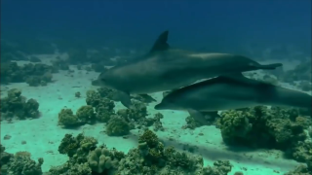
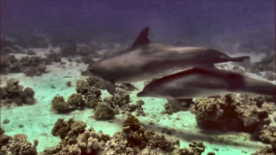
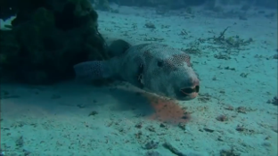
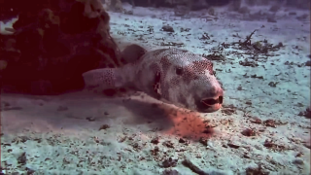

# Single-Image Underwater Restoration Project


**Author:** Giannakopoulos Nikolaos Ioannis

---

## 📌 Introduction
Underwater photography often suffers from blur, low contrast, and color distortion (such as green/blue casts) due to the scattering and absorption of light in the water medium. These issues make object identification and marine life study difficult.

The goal of this project is to improve the quality of single underwater images without relying on specialized hardware. The proposed solution restores natural colors, enhances contrast, and preserves details by learning statistical parameters from paired underwater and clean images.

---

## ⚙️ Methodology
This project implements a comprehensive restoration pipeline that combines statistical learning with classical computer vision algorithms. The process, implemented in `script.py`, consists of the following stages:

1.  **Dehazing (Dark Channel Prior - DCP):** Estimates the atmospheric light and removes haze caused by global scattering.
2.  **Dataset Normalization:** Performs channel-wise normalization using mean and standard deviation statistics derived from the training dataset to balance color and brightness.
3.  **LUT-based Remapping:** Applies a computed Look-Up Table (LUT) to map pixel values from the raw domain to the target domain.
4.  **CLAHE:** Applies Contrast Limited Adaptive Histogram Equalization on the L-channel (LAB color space) for local contrast enhancement.
5.  **Bilateral Filtering:** Smooths noise while preserving edges by considering both pixel distance and color similarity.
6.  **Unsharp Masking:** Sharpens the final output to enhance high-frequency details.

---

## 📸 Results

### Visual Comparison
Below are examples of the restoration pipeline applied to real underwater images.

<table>
  <tr>
    <th align="center">Raw Input</th>
    <th align="center">Restored Output</th>
  </tr>
  <tr>
    <td align="center"></td>
    <td align="center"></td>
  </tr>
  <tr>
    <td align="center"><em>Original underwater capture</em></td>
    <td align="center"><em>Restored image</em></td>
  </tr>
  <tr>
    <td align="center"></td>
    <td align="center"></td>
  </tr>
  <tr>
    <td align="center"><em>Original underwater capture</em></td>
    <td align="center"><em>Restored image</em></td>
  </tr>
</table>

### Quantitative Metrics
The method was evaluated on 50 underwater images and compared against individual component methods (DCP-only and CLAHE-only). The proposed integrated pipeline achieves the best balance between Peak Signal-to-Noise Ratio (PSNR) and Structural Similarity Index (SSIM).

| Method | PSNR (dB) | SSIM |
| :--- | :---: | :---: |
| Raw Input | 12.3 | 0.52 |
| DCP Only | 16.2 | 0.68 |
| CLAHE Only | 14.5 | 0.60 |
| **Ours (Pipeline)** | **17.4** | **0.78** |

---

## 📂 Dataset
To compute the restoration parameters (LUTs and Statistics), the project utilized the dataset:
**"An Underwater Image Enhancement Benchmark Dataset and Beyond"**.

* **Size:** 890 paired images (Underwater / Ground Truth).
* **Purpose:** The 890 pairs were used to train the model to map raw underwater characteristics to a clean appearance.

---

## 🚀 Installation & Usage

### Prerequisites
The project requires Python 3 and the following libraries:
```bash
pip install numpy opencv-python tqdm
```
1. Build Mode (Training)
This mode processes the dataset directories to generate the statistical parameters and Look-Up Tables, saving them to a .pkl file.

```bash

python image_project.py --mode build --raw_dir raw/ --target_dir goal/ --params_path parameters.pkl
```
Arguments:
```bash
--raw_dir: Directory containing the raw underwater images.

--target_dir: Directory containing the clean (target) images.

--params_path: Output path for the parameters file.
```

2. Restore Mode (Inference)
This mode applies the restoration pipeline to a single new image using the generated parameters.

```bash

python image_project.py --mode restore --image path/to/underwater.png --params_path parameters.pkl --dehaze --sharp_amount 1.0
```
Arguments:
```bash
--image: Path to the input image.

--params_path: Path to the .pkl file generated in Build mode.

--dehaze: (Optional) Enables the Dark Channel Prior dehazing step.

--sharp_amount: (Optional) Adjusts the sharpening intensity (default: 1.0).
```
